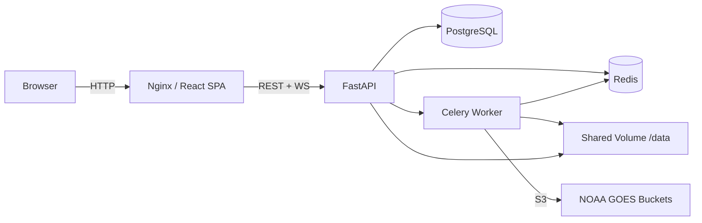

# 🛰️ Satellite Processor


A web-based GOES satellite data platform for fetching, browsing, and animating imagery from NOAA's geostationary satellites.

## Architecture



**Services:**
- **Frontend** — React 18 + TypeScript + Vite + Tailwind CSS v4 (served via Nginx)
- **API** — FastAPI with async SQLAlchemy, WebSocket for live job progress
- **Worker** — Celery worker running the core `satellite_processor` engine
- **PostgreSQL** — Job history, image metadata, frame library, collections
- **Redis** — Celery broker + result backend + pub/sub events

## Quick Start

```bash
# Clone and start all services
git clone https://github.com/jtn0123/satellite_processor.git
cd satellite_processor
docker compose up --build -d

# Open in browser
open http://localhost:3000
```

The API docs are available at [http://localhost:8000/docs](http://localhost:8000/docs).

## Features

- **GOES Fetch** — Pull imagery from GOES-16, GOES-18, GOES-19 across all 16 ABI bands and 4 sectors
- **Browse & Search** — Filter, tag, and organize frames with collections
- **Animations** — Generate timelapse GIFs/MP4s with customizable FPS, resolution, and overlays
- **Image Comparison** — Side-by-side and slider comparison of any two frames
- **Composites** — Create false-color composite images from multiple bands
- **Gap Detection & Backfill** — Automatically find and fill missing frames
- **Scheduling** — Set up recurring fetch jobs with cron-style schedules
- **Cleanup Rules** — Automated retention policies to manage disk usage
- **Public Share Links** — Generate expiring public URLs for individual frames
- **Real-time Progress** — WebSocket-powered live job monitoring
- **System Dashboard** — Disk, CPU, and memory monitoring with charts

## Tech Stack

| Layer | Technology |
|-------|-----------|
| Frontend | React 18, TypeScript, Vite, Tailwind CSS v4, TanStack Query |
| Backend | Python 3.12, FastAPI, SQLAlchemy 2.0, Celery |
| Database | PostgreSQL 16 |
| Cache/Queue | Redis 7 |
| Containerization | Docker, Docker Compose |
| CI/CD | GitHub Actions → GHCR |

## API Documentation

Interactive API docs are available at the `/docs` endpoint (Swagger UI) or `/redoc` (ReDoc) when the API is running.

## Development

```bash
# Dev mode with hot-reload
make dev

# Run tests
make test

# Frontend dev server (outside Docker)
cd frontend && npm install && npm run dev
```

### Pre-commit Hooks

```bash
pip install pre-commit
pre-commit install
pre-commit run --all-files
```

## CI/CD

- **PRs** → runs Python tests, frontend build check, linting (`.github/workflows/test.yml`)
- **Push to `release`** → builds and pushes Docker images to GHCR (`.github/workflows/docker.yml`)

## License

MIT
